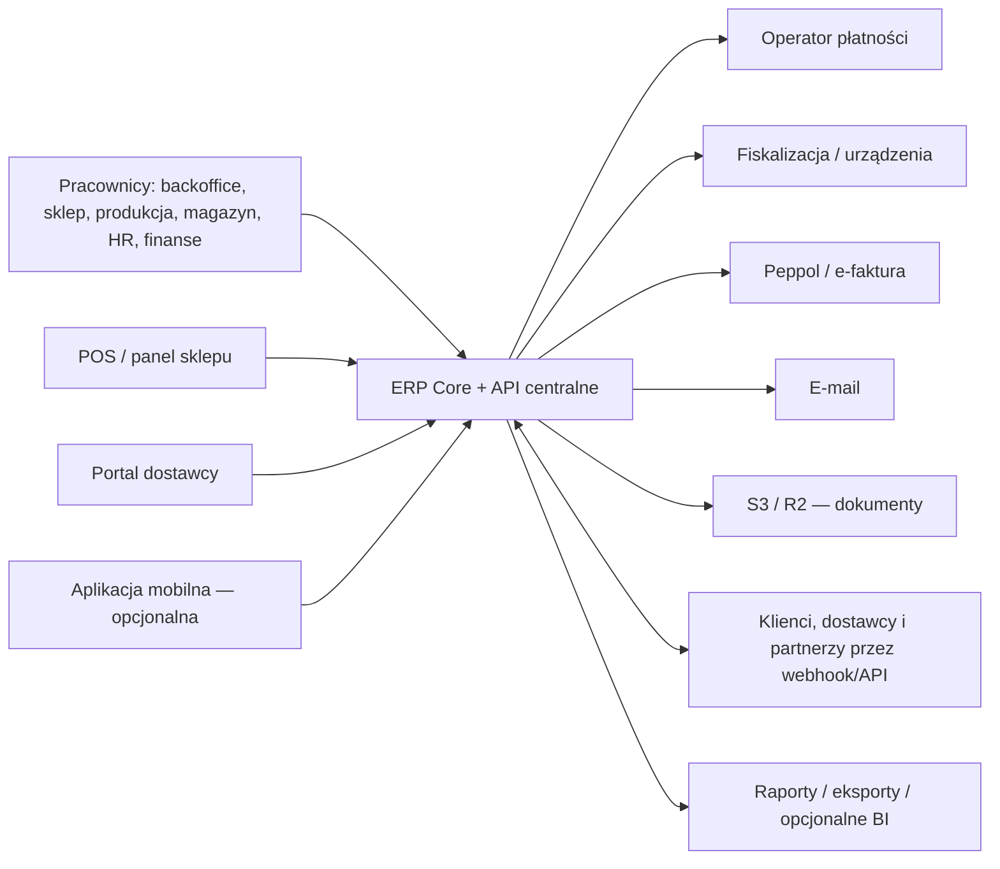

# Kontekst systemu

```mermaid
flowchart LR
    Users["Pracownicy: backoffice, sklep, produkcja, magazyn, HR, finanse"] --> ERP["ERP Core + API centralne"]
    POS["POS / panel sklepu"] --> ERP
    Supplier["Portal dostawcy"] --> ERP
    Mobile["Aplikacja mobilna — opcjonalna"] --> ERP
    ERP --> Pay["Operator płatności"]
    ERP --> Fiscal["Fiskalizacja / urządzenia"]
    ERP --> EInv["Peppol / e-faktura"]
    ERP --> Mail["E-mail"]
    ERP --> Store["S3 / R2 — dokumenty"]
    ERP <--> Partners["Klienci, dostawcy i partnerzy przez webhook/API"]
    ERP --> BI["Raporty / eksporty / opcjonalne BI"]
```

Centralny ERP jest jedynym właścicielem reguł i faktów. Systemy zewnętrzne komunikują się przez adaptery i nie zapisują bezpośrednio do bazy.
