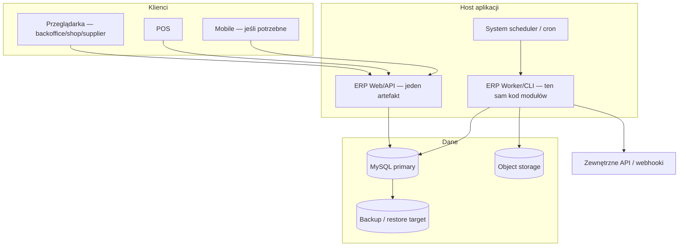

# Widok wdrożeniowy

```mermaid
flowchart TB
    subgraph Clients["Klienci"]
        Browser["Przeglądarka — backoffice/shop/supplier"]
        POS["POS"]
        Mobile["Mobile — jeśli potrzebne"]
    end
    subgraph AppHost["Host aplikacji"]
        Web["ERP Web/API — jeden artefakt"]
        Worker["ERP Worker/CLI — ten sam kod modułów"]
        Scheduler["System scheduler / cron"]
        Scheduler --> Worker
    end
    subgraph Data["Dane"]
        DB[("MySQL primary")]
        Files[("Object storage")]
        Backup[("Backup / restore target")]
    end
    Browser --> Web
    POS --> Web
    Mobile --> Web
    Web --> DB
    Worker --> DB
    Worker --> Files
    DB --> Backup
    Worker --> External["Zewnętrzne API / webhooki"]
```

Read replica, broker i oddzielna analytics DB nie należą do minimalnej topologii.
