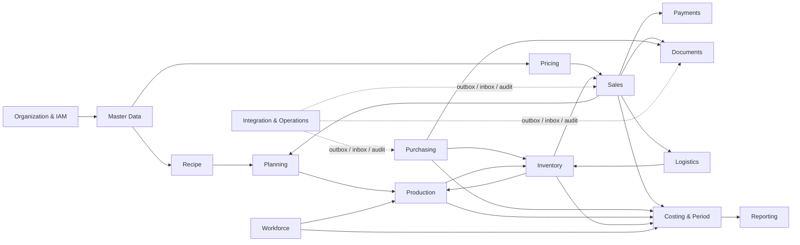

# Zależności modułów

```mermaid
flowchart LR
    IAM["Organization & IAM"] --> MD["Master Data"]
    MD --> Recipe["Recipe"]
    MD --> Pricing["Pricing"]
    Recipe --> Planning["Planning"]
    Pricing --> Sales["Sales"]
    Sales --> Payments["Payments"]
    Sales --> Documents["Documents"]
    Sales --> Logistics["Logistics"]
    Sales --> Planning
    Planning --> Production["Production"]
    Inventory["Inventory"] --> Sales
    Inventory --> Production
    Purchasing["Purchasing"] --> Inventory
    Purchasing --> Documents
    Production --> Inventory
    Workforce["Workforce"] --> Production
    Logistics --> Inventory
    Sales --> Costing["Costing & Period"]
    Purchasing --> Costing
    Production --> Costing
    Inventory --> Costing
    Workforce --> Costing
    Costing --> Reporting["Reporting"]
    Integration["Integration & Operations"] -. "outbox / inbox / audit" .-> Sales
    Integration -. "outbox / inbox / audit" .-> Documents
    Integration -. "outbox / inbox / audit" .-> Purchasing
```

Zależność oznacza publiczny interface/event. Moduł nie zapisuje tabel modułu zależnego.
