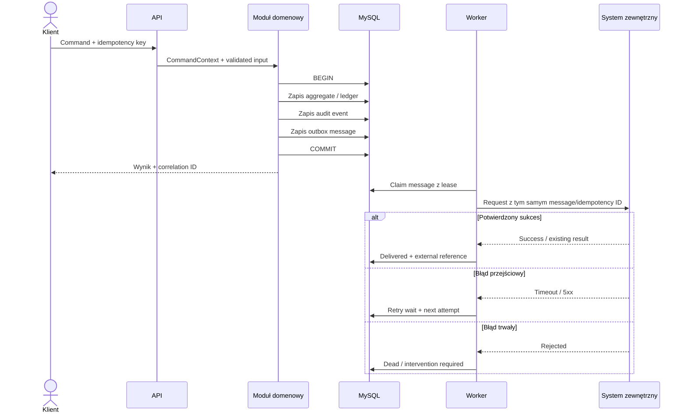

# Transakcja i outbox

```mermaid
sequenceDiagram
    actor Client as Klient
    participant API as API
    participant Domain as Moduł domenowy
    participant DB as MySQL
    participant Worker as Worker
    participant External as System zewnętrzny
    Client->>API: Command + idempotency key
    API->>Domain: CommandContext + validated input
    Domain->>DB: BEGIN
    Domain->>DB: Zapis aggregate / ledger
    Domain->>DB: Zapis audit event
    Domain->>DB: Zapis outbox message
    Domain->>DB: COMMIT
    Domain-->>Client: Wynik + correlation ID
    Worker->>DB: Claim message z lease
    Worker->>External: Request z tym samym message/idempotency ID
    alt Potwierdzony sukces
        External-->>Worker: Success / existing result
        Worker->>DB: Delivered + external reference
    else Błąd przejściowy
        External-->>Worker: Timeout / 5xx
        Worker->>DB: Retry wait + next attempt
    else Błąd trwały
        External-->>Worker: Rejected
        Worker->>DB: Dead / intervention required
    end
```
