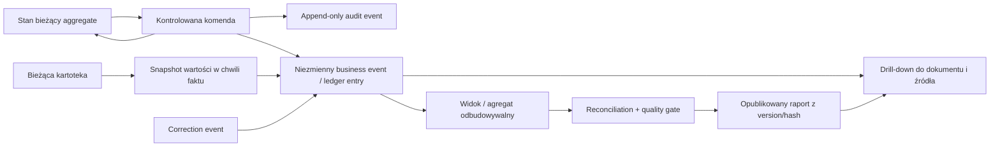

# Historia i raportowanie

```mermaid
flowchart LR
    Current["Stan bieżący aggregate"] --> Command["Kontrolowana komenda"]
    Command --> Current
    Command --> Audit["Append-only audit event"]
    Command --> Fact["Niezmienny business event / ledger entry"]
    Master["Bieżąca kartoteka"] --> Snapshot["Snapshot wartości w chwili faktu"]
    Snapshot --> Fact
    Fact --> Read["Widok / agregat odbudowywalny"]
    Read --> Reconcile["Reconciliation + quality gate"]
    Reconcile --> Published["Opublikowany raport z version/hash"]
    Correction["Correction event"] --> Fact
    Fact --> Drill["Drill-down do dokumentu i źródła"]
    Published --> Drill
```

Raport historyczny korzysta ze snapshotu i korekt, nie z aktualnej kartoteki do interpretacji wartości z przeszłości.
