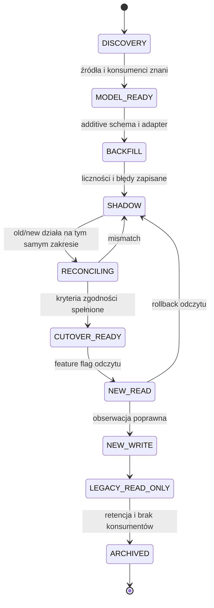

# Migracja i przełączenie

```mermaid
stateDiagram-v2
    [*] --> DISCOVERY
    DISCOVERY --> MODEL_READY: źródła i konsumenci znani
    MODEL_READY --> BACKFILL: additive schema i adapter
    BACKFILL --> SHADOW: liczności i błędy zapisane
    SHADOW --> RECONCILING: old/new działa na tym samym zakresie
    RECONCILING --> SHADOW: mismatch
    RECONCILING --> CUTOVER_READY: kryteria zgodności spełnione
    CUTOVER_READY --> NEW_READ: feature flag odczytu
    NEW_READ --> NEW_WRITE: obserwacja poprawna
    NEW_READ --> SHADOW: rollback odczytu
    NEW_WRITE --> LEGACY_READ_ONLY
    LEGACY_READ_ONLY --> ARCHIVED: retencja i brak konsumentów
    ARCHIVED --> [*]
```

Po przełączeniu zapisu rollback nie usuwa nowych faktów; stosuje forward fix lub domenową kompensację.
