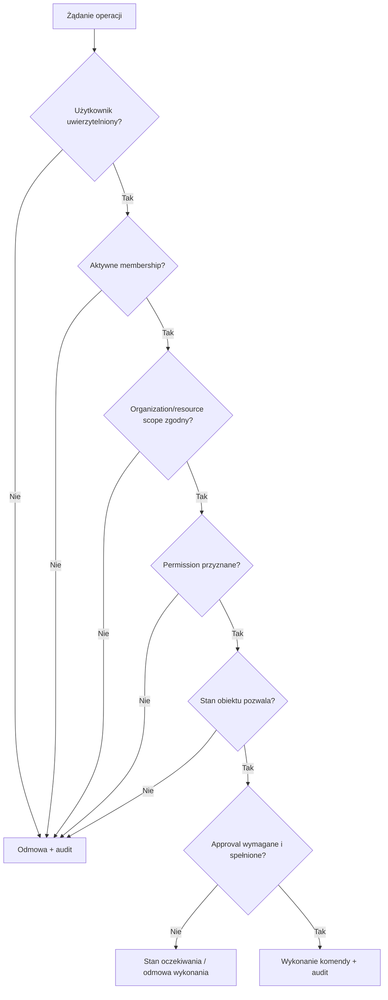

# Ewaluacja uprawnienia

```mermaid
flowchart TD
    R["Żądanie operacji"] --> A{"Użytkownik uwierzytelniony?"}
    A -- "Nie" --> Deny["Odmowa + audit"]
    A -- "Tak" --> M{"Aktywne membership?"}
    M -- "Nie" --> Deny
    M -- "Tak" --> O{"Organization/resource scope zgodny?"}
    O -- "Nie" --> Deny
    O -- "Tak" --> P{"Permission przyznane?"}
    P -- "Nie" --> Deny
    P -- "Tak" --> S{"Stan obiektu pozwala?"}
    S -- "Nie" --> Deny
    S -- "Tak" --> V{"Approval wymagane i spełnione?"}
    V -- "Nie" --> Pending["Stan oczekiwania / odmowa wykonania"]
    V -- "Tak" --> Execute["Wykonanie komendy + audit"]
```
